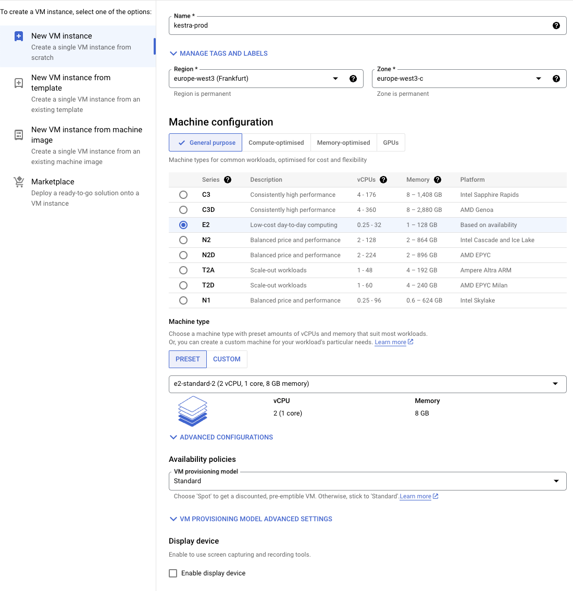
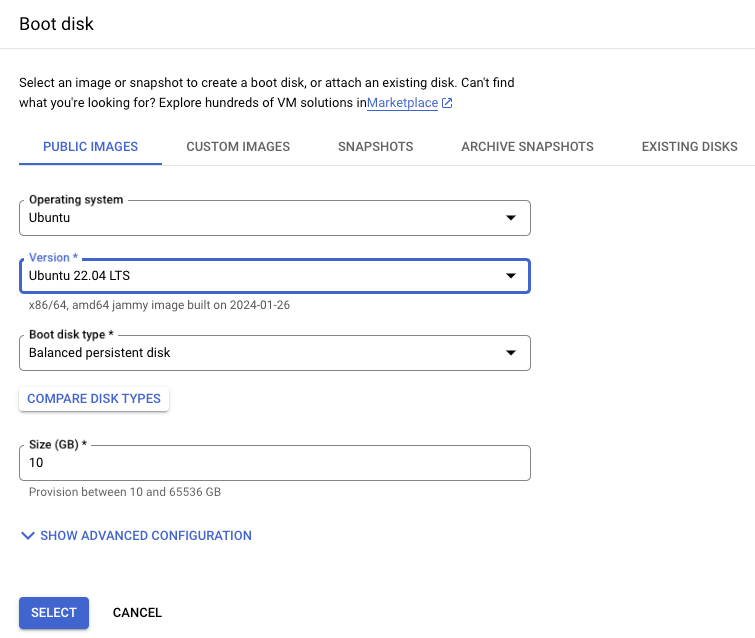
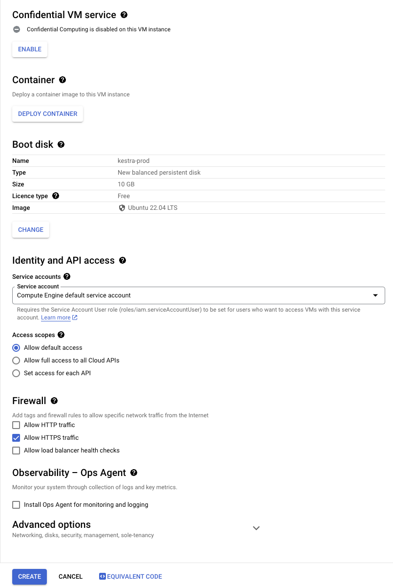

Install Kestra on a GCP VM with Cloud SQL Postgres database backend and Cloud Storage as internal storage backend.

## Overview
This guide provides instructions for deploying Kestra on Google Cloud Platform (GCP). We’ll use Compute Engine with Docker to host Kestra server, a PostgreSQL Cloud SQL database and Cloud Storage as storage backend.

Prerequisites:
* basic knowledge about using a command line interface
* basic knowledge about Compute Engine, Cloud Storage and PostgreSQL.

## Create a VM instance

First, create a VM instance using the Compute Engine. To do so, [go to the GCP console and choose Compute Engine](https://console.cloud.google.com/compute/instances).
1. Click on the `Create Instance` button at the top.
2. Give a name to your instance.
3. Choose an appropriate Region and Zone.
4. Choose the `General Purpose` machine of the `E2` series.
5. Machine type: Kestra needs at least 4GiB Memory and 2vCPU to run correctly. Choosing the `Preset` machine type `e2-standard-2` is a good starting point.
6. Click on `Change` in the "Boot Disk" section, as we would like to change the image.
7. Under the "Public Images" tab, choose `Ubuntu` as the operating system and the `Ubuntu 22.04 LTS` version.
8. Continue with the "Allow default access" access scope, and select "Allow HTTPS traffic" in the Firewall section.








You can now click on "Create" and wait a few seconds for the VM instance to be up and running.

## Install Docker

Click on the `SSH` button on the right side of the VM instance details to SSH into the VM instance terminal. Click on the `Authorize` button in the pop-up to authorize the SSH connection into the VM instance.


Kestra can be started directly from a `.jar` binary or using Docker. We’ll use Docker here for a quicker setup.
Install Docker on the EC2 instance. [You can find the last updated instruction on the Docker website](https://docs.docker.com/engine/install/ubuntu/).

To check your installation, run `sudo docker version` and `sudo docker compose version`. You're now ready to download and launch the Kestra server.


## Install Kestra

Download the official Docker-Compose file: `curl -o docker-compose.yml https://raw.githubusercontent.com/kestra-io/kestra/develop/docker-compose.yml`

Use an editor such as Vim to modify the `docker-compose.yml`, set basic authentication to true, and configure your basic authentication credentials to secure your Kestra instance.

```yaml
kestra:
  server:
    basic-auth:
      enabled: true
      username: admin@kestra.io # it must be a valid email address
      password: kestra
```


::alert{type="warning"}
Note that if you haven't set up basic authentication in the previous step, your Kestra instance will be publicly available to anyone without any access restriction.
::

You can now access your Kestra instance and start developing flows.


## Launch Cloud SQL

This first installation relies on a PostgreSQL database running alongside the Kestra server - on the VM instance (see the PostgreSQL service running thanks to the docker-compose).

For a simple PoC, you can keep that Postgres database running in Docker.

However, for a production-grade installation, we recommend a managed database service such as Cloud SQL.

**Create a Cloud SQL database**

1. Go to the [Cloud SQL console](https://console.cloud.google.com/sql/instances).
2. Click on `Choose PostgreSQL` (Kestra also supports MySQL, but PostgreSQL is recommended).
3. Put an appropriate Instance ID and password for the admin user `postgres`.
4. Select the latest PostgreSQL version from the dropdown.
5. Choose `Enterprise Plus` or `Enterprise` edition based on your requirements.
6. Choose an appropriate preset among `Production`, `Development` or `Sandbox` as per your requirement.
7. Choose the appropriate region and zonal availability.
8. Expand Show `Show Configuration Options` at the bottom of the page.


**Enable VM connection to database**

1. Expand the `Connections` section from the drop downs.
2. Uncheck Public IP and check Private IP. If this is your first time using a Private IP connection you will be prompted to `Setup Connection`.
3. You will then need to choose `Enable API` on the right hand side pop out.
4. Choose `Use an automatically allocated IP range` and click `Continue`.
5. Click on `Create Connection`.


**Enable Deletion**

If you are just testing or would like to be able to delete your instance and all of it's data:
1. Expand out the `Data Protection` on the left hand side and make sure `Enable deletion protection` is UNCHECKED


**Create database user**

1. Go to the database overview page and click on `Users` from the left-side navigation menu.
2. Click on `Add User Account`.
3. Put an appropriate username and password, and click on `Add`.


**Create Kestra database**

1. Go to the database overview page, and click on `Databases` from the left side navigation menu.
2. Click on `Create Database`.
3. Put an appropriate database name, and click on `Create`.

**Update Kestra configuration**

In the docker-compose configuration, edit the `datasources` property of the Kestra service in the following way:

```yaml
datasources:
  postgres:
    url: jdbc:postgresql://<your-db-external-endpoint>:5432/<db_name>
    driverClassName: org.postgresql.Driver
    username: <your-username>
    password: <your-password>
```
And delete the `depends_on` section at the end of the yaml file:

```yaml
    depends_on:
      postgres:
        condition: service_started
```

Because you now use the Cloud SQL service, you don't need the Postgres Docker service anymore. Remove it from the `docker-compose.yml` file.

In order for the changes to take effect, restart the docker services with `sudo docker compose restart` or `sudo docker compose up -d`.


## Configure GCS

By default, internal storage is implemented using the local file system. This section will guide you on how to change the storage backend to Cloud Storage to ensure more reliable, durable, and scalable storage.

1. Go to the Cloud Storage console and create a bucket.
2. Go to IAM and select `Service Accounts` from the left-side navigation menu.
3. On the Service Accounts page, click on `Create Service Account` at the top of the page.
4. Put the appropriate Service account name and Service account description, and grant the service account `Storage Admin` access. Click Done.
5. On the Service Accounts page, click on the newly created service account.
6. On the newly created service account page, go to the `Keys` tab at the top of the page and click on `Add Key.` From the dropdown, select `Create New Key`.
7. Select the Key type as `JSON` and click on `Create`. The JSON key file for the service account will get downloaded.
8. We will be using the stringified JSON for our configuration. You can use the bash command `% cat <path_to_json_file> | jq '@json'` to generate stringified JSON.
9. Edit Kestra storage configuration.

```yaml
kestra:
  storage:
    type: gcs
    gcs:
      bucket: "<your-cloud-storage-bucket-name>"
      project: "<your-gcp-project-name>"
      serviceAccount: "<stringified-json-file-contents>"
```

In order for the changes to take effect, restart the docker services with `sudo docker compose restart` or `sudo docker compose up -d`.


## Next steps

This guide walked you through installing Kestra on a GCP VM instance with Cloud SQL database and Cloud Storage as storage backend.

This setup provides the easiest starting point for running Kestra in production on a single machine. For a deployment to a distributed cluster on GCP, check the [GKE Kubernetes deployment guide](./05.kubernetes-gcp-gke.md).

Reach out via [Slack](https://kestra.io/slack) if you encounter any issues or if you have any questions regarding deploying Kestra to production.

Make sure to also check the [CI/CD guide](https://kestra.io/docs/developer-guide/cicd) to automate your workflow deployments based on changes in Git.
