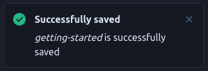

# Getting Started

This document will guide you through setting up Kestra in a few minutes and creating your first flow.

## Prerequisites

Make sure the following is installed:
- Docker, [Docker Desktop](https://docs.docker.com/get-docker/) is the easiest way to use it.

## Run Kestra

### Download Docker Compose file

Download the Docker Compose file for Kestra using the following command:

```bash
curl -o docker-compose.yml https://raw.githubusercontent.com/kestra-io/kestra/develop/docker-compose.yml
```

If you don't have curl installed, you can download the [Docker Compose file](https://github.com/kestra-io/kestra/blob/develop/docker-compose.yml) and save it as `docker-compose.yml`.

### Start your server

Make sure the Docker is up and running. Then, run the following command:

```bash
docker compose up -d
```

Open [http://localhost:8080](http://localhost:8080) in your browser.

## Create your first flow

In the **Flow** menu, click the "Create" button and paste the following flow:

```yaml
id: getting-started
namespace: io.kestra.tutorial
tasks:
- type: io.kestra.core.tasks.debugs.Echo
  id: echo-task
  format: Hello World !
```

When you're done, click on the **Save** button to save it and start your first execution via the **Create Execution** button.



<NextStep message="For a better introduction to Kestra, follow our Tutorial" link="../tutorial"/>

## Next Steps

Now, you're ready to use Kestra! :rocket:

As the next steps, we suggest reading the following documentation in this order:
- Follow the [tutorials](../tutorial) and create your first flow with all the Kestra possibilities!
- Learn Kestra [concepts](../concepts).
- Read the [Developer Guide](../developer-guide) to understand how to build your own flow.
- Look at [Plugins](../../plugins) to perform some real tasks.
- [Deploy](../administrator-guide) your Kestra instance to real environments.
