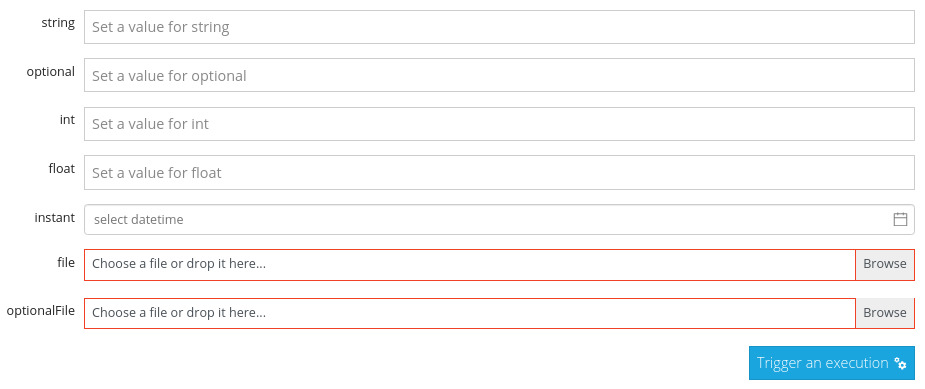

# Inputs

Kestra's flow can be parametrized using inputs. Inputs will be available in variable 
context and can be used during the whole flow, in order to customize it depending on 
inputs.

A good example is you need to have an identifier (ex: storeId, paymentId) in order to 
change save path for the uplodated files.


## Declaring inputs 

You can declare as many inputs for any flow. Input can be **required** or **not**. 
If the input are required, the flow couldn't start if the input are not provide during the 
creation of the execution.
Also, every inputs will be parsed during the creation of the execution and any invalid 
inputs will refuse to create the execution.

::: warning
If the execution is **not created** due to invalid or missing inputs, no execution will be 
found on the executions list.
:::

Examples: 
```yaml
id: my-flow
namespace: org.kestra.docs

inputs:
  - name: string
    type: STRING
    required: true
  - name: optional
    type: STRING
    required: false
  - name: int
    type: INT
    required: true
  - name: float
    type: FLOAT
    required: true
  - name: instant
    type: DATETIME
    required: true
  - name: my-file
    type: FILE
    required: true
  - name: optionalFile
    type: FILE
    required: false
```

## Input types
Here are the following input fields available :

### `STRING`
No control is done on this input type (no parsing), can be any string.

### `INT`
Must be a valid integer (without any decimals).

### `FLOAT`
Must be a valid float (with any decimals).

### `DATETIME`
Must be a valid valid full [ISO 8601](https://en.wikipedia.org/wiki/ISO_8601) datetime with timezone in UTC from a text string such as
`2007-12-03T10:15:30.00Z`.

### `FILE`
Must be a files send with `multipart/form-data`. All the file are automatically uploaded 
to `Storage` and is available for further task. 

## Using input value in flow

Every input is available with dynamic variable like : <code v-pre>{{ inputs.NAME }}</code>.

For example, considering that you declare your input : 
```yaml
inputs:
  - name: my-file
    type: FILE
  - name: my-value
    type: STRING
    required: true
```

You can use the value of the inputs with <code v-pre>{{ inputs.my-value }}</code>.

The only exception is the input type `FILE`, you must use the variable 
<code v-pre>{{ inputs.my-file.uri }}</code> in order to access to the url of the input.


## Send inputs programmatically 
The flow `my-flow` above can be triggered programmaticaly, here is an example with `curl`:
```bash
curl -v "http://kestra:8080/api/v1/executions/trigger/org.kestra.docs/my-flow" \
    -H "Transfer-Encoding:chunked" \
    -H "Content-Type:multipart/form-data" \
    -F string="a string"  \
    -F optional="an optionnal string"  \
    -F int=1  \
    -F float=1.255  \
    -F instant=2020-01-14T23:00:00.000Z \
    -F "files=@/tmp/128M.txt;filename=my-file"
```

All files must be send in a form data `files` with an header `filename=my-file` that 
will be the name of the input.

## Send inputs via WebUI
With such flow, the web ui let you input some inputs by generating a form accordingly 
on the flow > trigger view. The input form for the task above looks like below :



Once inputs filled, you can trigger a flow execution that will run with 
[contextual inputs](/docs/dynamic-fields) as task variables.