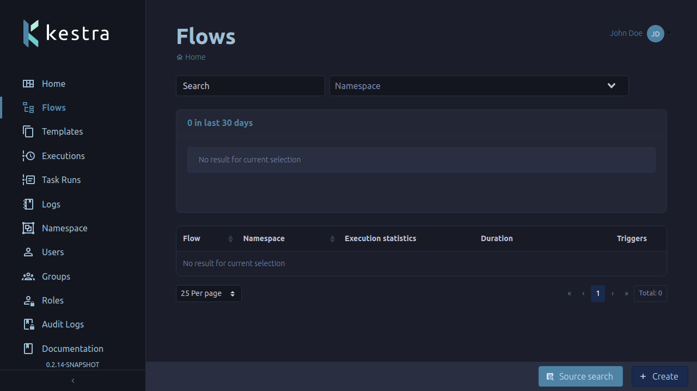
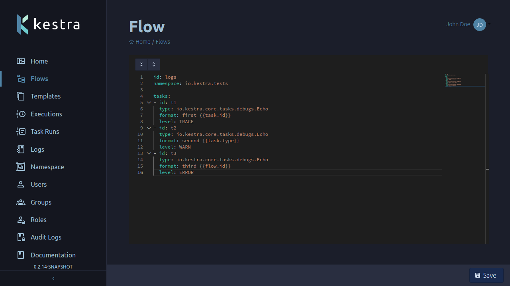
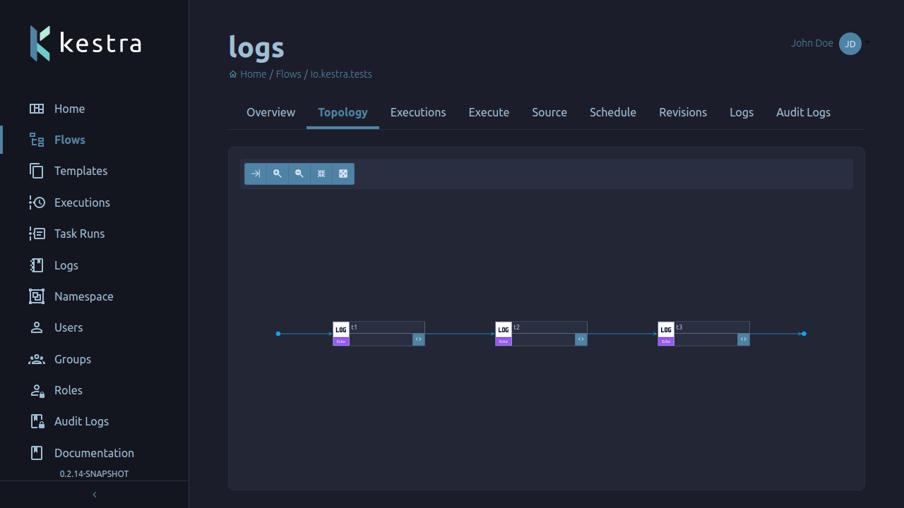
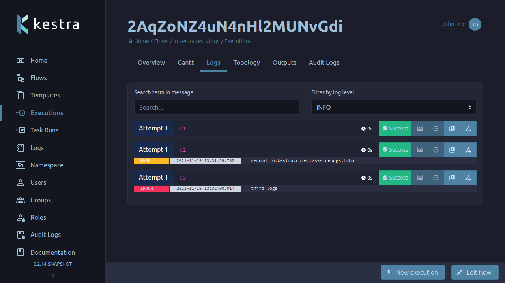
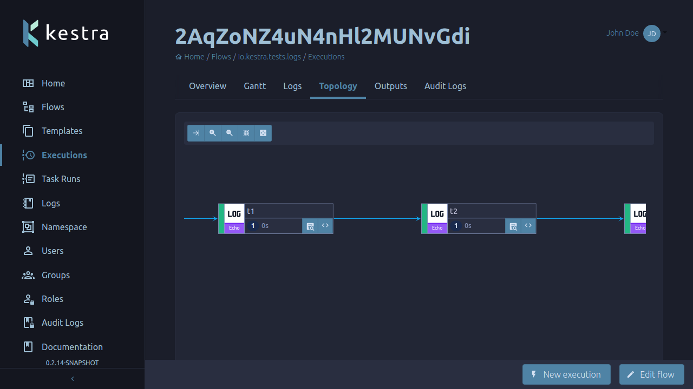

# Getting Started


## Before you begin
Make sure you have already installed:
- [Docker](https://docs.docker.com/engine/install/)
- [Docker Compose](https://docs.docker.com/compose/install/)

## Launch Kestra

- Download the compose file [here](https://github.com/kestra-io/kestra/blob/develop/docker-compose.yml)
- Run `docker-compose up -d`
- Open `http://localhost:8080` on your browser


## Create your first flow
The default installation is empty and don't contain any flows. 




We will create the first one : 



* Click on the `Create` button at the button
* Paste the flow below 
* Click on save 

```yaml
id: logs
namespace: org.kestra.tests

tasks:
- id: t1
  type: org.kestra.core.tasks.debugs.Echo
  format: first {{task.id}}
  level: TRACE
- id: t2
  type: org.kestra.core.tasks.debugs.Echo
  format: second {{task.type}}
  level: WARN
- id: t3
  type: org.kestra.core.tasks.debugs.Echo
  format: third {{flow.id}}
  level: ERROR
```

You will see the Topology of your flow as graph on `Overview` tabs. 




## Execute your first flow 
Now let's run our first flow and see it running : 

* Now hit the button `Execute` on top Tabs. 
* You will see in Real time the execution of the current flow

* Look at the log of the current tasks on `Logs`

* And watch the topology of the current execution.



## Next Steps
Now, you are ready to use Kestra ! 

Now I suggest you to read some documentations in order:
- to understand Kestra [concepts](../concepts).
- read the [Developer Guide](../developer-guide) to understand how to code your own flow.
- Look at [Plugins](../../plugins) to have some real task .
- [Deploy](../administrator-guide) your kestra instance to real environments.  

